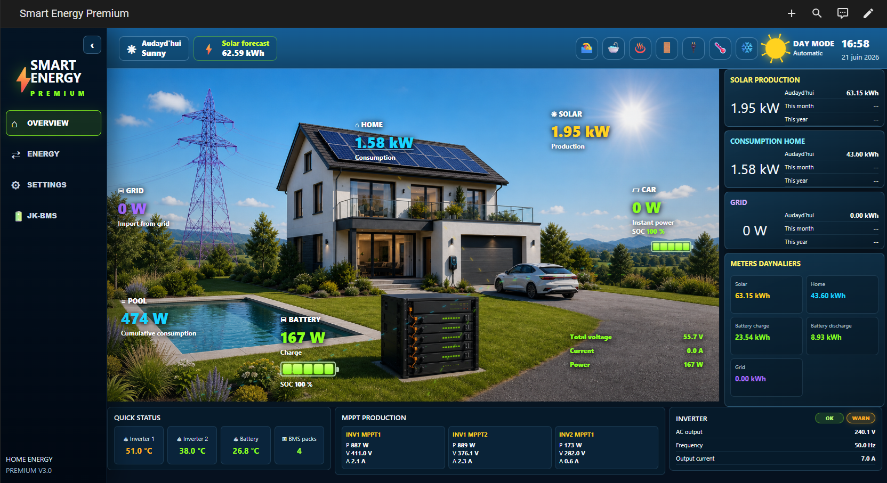
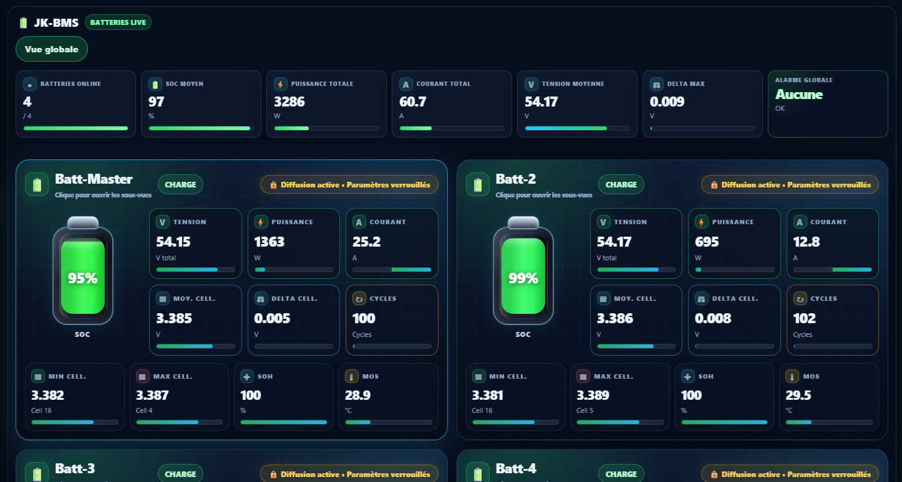

⭐ **If this add-on is useful to you, please star this repository!**  
It helps other Home Assistant users discover the project and supports future development.

[](https://github.com/jean-luc1203/jkbms-rs485-addon/stargazers)
[](https://github.com/jean-luc1203/jkbms-rs485-addon)
[](https://github.com/jean-luc1203/jkbms-rs485-addon)
[](https://www.home-assistant.io/)
[](https://mqtt.org/)
[](https://github.com/jean-luc1203/jkbms-rs485-addon/tree/main/standalone)
[](https://github.com/jean-luc1203/jkbms-rs485-addon/discussions)

---

# SmartPhoton JK-BMS RS485 & CAN Bus Add-on

> **8,300+ installations worldwide** · **67 countries** · **Community-driven development** · **Professional Home Assistant integration**

[](https://ko-fi.com/Y8Y3YHYZP)
[](https://www.paypal.com/ncp/payment/PSQPALQJT9UBW)

**SmartPhoton JK-BMS** is a professional Home Assistant add-on for monitoring, controlling and integrating JK-BMS battery management systems through:

- **RS485 USB adapters**
- **RS485 TCP/IP gateways**
- **CAN Bus**
- **MQTT Discovery**
- **Home Assistant dashboards**
- **Optional SmartPhoton Premium dashboards**

It transforms Home Assistant into a complete battery monitoring and energy management platform with multi-BMS support, advanced diagnostics, alarm management, safer operating modes and automatic dashboard generation.

---

## 🎬 Latest video: major update + Premium dashboards

The latest video presents the main improvements made since the previous release and introduces the new SmartPhoton Premium dashboard ecosystem.

▶️ **Watch the update video:**  
https://youtu.be/IA0ijoGuG54

---

## ✨ New: SmartPhoton Premium Dashboards

The biggest visible change is the introduction of **auto-generated SmartPhoton Premium dashboards**.

Premium dashboards are designed for users who want a clean, professional and ready-to-use Home Assistant energy interface without manually building Lovelace cards, YAML dashboards or custom navigation.

### What Premium adds

- Automatic dashboard generation
- No manual YAML editing
- No manual Lovelace card creation
- Modern HTML dashboard
- Legacy Home Assistant Lovelace dashboard
- Dynamic module menus
- Multi-BMS visual overview
- Individual BMS pages
- Cell voltage diagnostics
- Alarm and status views
- Settings pages with safety-aware read-only behavior
- French and English dashboard generation
- SmartPhoton ecosystem integration

### Modern Smart Energy dashboard preview



### JK-BMS Premium dashboard preview



---

## Free vs Premium

| Area | Free add-on | Premium dashboards |
|---|---|---|
| Read JK-BMS data | ✅ Yes | ✅ Yes |
| RS485 USB support | ✅ Yes | ✅ Yes |
| RS485 TCP/IP gateway support | ✅ Yes | ✅ Yes |
| CAN Bus support | ✅ Yes | ✅ Yes |
| MQTT Discovery | ✅ Yes | ✅ Yes |
| Home Assistant entities | ✅ Yes | ✅ Yes |
| Multi-BMS monitoring | ✅ Yes | ✅ Yes |
| Alarm monitoring | ✅ Yes | ✅ Yes |
| Diagnostics and watchdog | ✅ Yes | ✅ Yes |
| Legacy dashboard generation | Limited / manual | ✅ Automatic |
| Modern HTML dashboard | ❌ No | ✅ Yes |
| Dynamic module menus | ❌ No | ✅ Yes |
| SmartPhoton ecosystem visual integration | ❌ No | ✅ Yes |
| Professional ready-to-use interface | Manual work required | ✅ Automatic |

The free add-on remains fully usable for monitoring and integrating JK-BMS systems into Home Assistant.

Premium dashboards are optional. They are intended for users who want a ready-to-use professional interface and who want to support the long-term development of the project.

---

## Main improvements in recent versions

Recent development focused on reliability, real-world multi-BMS installations and better Home Assistant integration.

### Data stability

The add-on now provides much more stable and reliable data in Home Assistant.

### Frame reconstruction

The add-on can rebuild RS485 / Modbus frames even when data chunks arrive out of order.

This improves reliability on installations where serial data can arrive fragmented, delayed or mixed in unexpected order.

### Improved RS485 / Modbus handling

The communication layer is stricter and more robust, with better frame parsing, diagnostics and interpretation.

### Multi-BMS improvements

The add-on is designed for installations with one or many JK-BMS units, including larger battery systems.

### MQTT Discovery improvements

Devices and entities are created automatically in Home Assistant through MQTT Discovery.

### Safer broadcasting mode

When the add-on is used in listening / broadcasting mode, settings are shown as read-only where direct editing would not be safe or technically valid.

### Diagnostics and watchdog logic

Improved health indicators help detect communication problems, stale data, buffer issues and RS485 instability.

---

## What is this add-on?

SmartPhoton JK-BMS is a professional-grade monitoring and control solution for JK-BMS battery management systems.

It provides:

- Real-time battery monitoring
- Multi-BMS management
- Home Assistant MQTT Discovery
- RS485 USB communication
- RS485 TCP/IP gateway support
- CAN Bus support
- Alarm monitoring
- Direct configuration from Home Assistant when technically safe
- Optional Premium dashboard generation
- Modular integration with the SmartPhoton ecosystem

No expensive proprietary software is required.

---

## Supported BMS models

Supported JK-BMS models include:

- PB2A16S20P
- PB2A16S15P
- PB1A16S15P
- PB1A16S10P
- PB2A16S30P
- All compatible models with firmware 14, 15 or 19
- Battery packs from **1S to 16S**

---

## ⚡ Key features

| Feature | Description |
|---|---|
| Variable cell count support | Automatically adapts to battery packs from 1S to 16S |
| Full configuration UI | Change BMS settings directly from Home Assistant when supported |
| Multiple connectivity options | RS485 USB, RS485 Ethernet/WiFi gateway and CAN Bus |
| Multi-BMS support | Manage up to 15 BMS units simultaneously |
| Native Home Assistant integration | Devices and entities created automatically through MQTT Discovery |
| MQTT compatible | Works with Home Assistant and any MQTT-compatible system |
| Alarm monitoring | Comprehensive alarm monitoring and status reporting |
| Diagnostics and watchdog | Helps detect communication issues and stale data |
| Premium dashboard system | Automatic generation of professional dashboards |
| Modern HTML dashboard | Responsive interface for desktop, tablet and smartphone |
| Legacy Lovelace dashboard | Traditional Home Assistant dashboard generation |
| Multi-language dashboard | Automatic French or English dashboard generation |
| Modular architecture | Compatible with other SmartPhoton energy modules |
| Docker standalone support | Can run independently from Home Assistant OS |

---

## Major upgrade: variable cell count support

The add-on supports battery packs with any cell count from **1S to 16S**.

> No more wrong cell delta values on non-16S packs.

### What this improves

- Correct support for 4S, 8S, 15S, 16S and other supported pack sizes
- Accurate cell minimum, maximum, average and delta calculations
- Automatic exclusion of unused cell slots
- Better dashboard accuracy
- More reliable automations and diagnostics

### Why this matters

Many real installations do not use exactly 16 cells.  
Without cell-count-aware logic, unused cell slots can distort cell statistics and create misleading dashboard values.

This feature makes the add-on more accurate for real-world battery installations.

---

## Available dashboard modes

Premium users can choose between two dashboard systems.

### 1. Legacy Lovelace dashboard

The Legacy dashboard uses native Home Assistant Lovelace cards.

It is ideal for users who prefer the traditional Home Assistant interface and want dashboards directly integrated into HA.

### 2. Modern HTML dashboard

The Modern HTML dashboard provides a responsive, professional and mobile-friendly interface.

It is designed for:

- Desktop computers
- Tablets
- Smartphones

Features include:

- Modern energy visualizations
- Fast navigation
- Responsive layout
- Mobile-optimized views
- Advanced battery visualization
- Historical charts
- Alarm monitoring
- Multi-BMS overview
- Dynamic module menus

### Both dashboards

Premium users can generate:

- Legacy Lovelace only
- Modern HTML only
- Both dashboards simultaneously

This allows each user to keep the interface that best fits their Home Assistant setup.

---

## Multi-language dashboard support

Dashboards can be generated automatically in the language selected in the add-on configuration.

Currently supported:

- English
- French

---

## SmartPhoton / Simply Home Energy ecosystem

SmartPhoton JK-BMS is part of a larger ecosystem for Home Assistant energy management.

Compatible or planned SmartPhoton modules include:

- SmartPhoton JK-BMS
- [Pylontech / Pelio](https://github.com/jean-luc1203/Pylontech-rs232-haos)
- SmartPhoton Victron
- SmartPhoton Voltronic
- SmartPhoton Kostal
- Smart Energy Finance
- SmartPhoton HTML Dashboard

Together, these modules can provide a unified view of:

- Battery packs
- BMS status
- Inverters
- Solar production
- Grid import / export
- Energy flows
- Financial savings
- System diagnostics
- Alarms and warnings

The dynamic menu system adapts to the modules installed on the Home Assistant system.

---

## Three operating modes

### 1️⃣ Master mode

The add-on queries each BMS directly through RS485.

This mode provides full monitoring and full configuration access.

```yaml
bms_broadcasting: false
```

Available features:

- Read live BMS data
- Modify BMS settings
- Monitor alarms
- Monitor cells
- Monitor temperatures
- Use full Home Assistant integration

---

### 2️⃣ Listening / broadcasting mode

One BMS acts as the RS485 master.  
The add-on listens to the RS485 traffic and publishes available data to Home Assistant.

This mode is useful when an inverter or another device must remain the bus master.

```yaml
bms_broadcasting: true
```

Available features:

- Read-only monitoring
- Multi-BMS data reception
- Home Assistant MQTT publishing
- Dashboard compatibility
- Safer settings handling

In this mode, settings may be displayed as read-only because the add-on is not directly controlling the BMS bus.

---

### 3️⃣ CAN Bus mode

CAN Bus mode uses the second RJ45 connector of compatible JK-BMS units.

This mode is designed for direct CAN Bus communication and autonomous broadcast operation.

---

## See it in action

### Control panel


### Hardware connection guide


---

## Important safety note

This add-on is designed for monitoring, automation and energy optimization.

It must **not** be the only safety layer of an electrical installation.

A failure of Home Assistant, Node-RED, MQTT, USB/RS485 communication, TCP/IP gateway communication or the host system should not be able, by itself, to create a critical power situation.

Please ensure your installation keeps safe fallback behavior, hardware protections and conservative default settings even if this add-on stops working or loses communication.

⚠️ See [SAFETY.md](SAFETY.md) for more details and recommended fail-safe design principles.

---

## Installation

### Via Home Assistant Add-on Store

1. Open Home Assistant
2. Go to **Settings**
3. Go to **Add-ons**
4. Open the **Add-on Store**
5. Click the three dots in the upper-right corner
6. Select **Repositories**
7. Add the repository URL:

```text
https://github.com/jean-luc1203/jkbms-rs485-addon
```

8. Install the add-on
9. Configure your settings
10. Start the add-on

---

## Docker standalone

SmartPhoton JK-BMS can also run independently from Home Assistant OS using Docker.

This is useful for:

- Home Assistant Core installations
- Docker-based Home Assistant installations
- Linux servers
- Virtual machines
- Advanced deployments

[Docker Installation Guide](https://github.com/jean-luc1203/jkbms-rs485-addon/blob/main/standalone/README.md)

Thanks to community contributor **@SergeyYmb**.

---

## Configuration

| Parameter | Description | Example |
|---|---|---|
| `path` | USB serial port path | `/dev/serial/by-id/usb-1a86_USB_Serial-if00-port0` |
| `nb_jkbms` | Number of BMS units | `1` to `15` |
| `use_gateway` | Enable TCP/IP gateway mode | `true` / `false` |
| `gateway_ip` | Gateway IP address | `192.168.1.100` |
| `gateway_port` | Gateway port | `502` |
| `bms_broadcasting` | Enable listening mode | `true` / `false` |
| `mqttaddress` | MQTT broker address | `192.168.1.50` |
| `mqttport` | MQTT broker port | `1883` |
| `mqttuser` | MQTT username | `homeassistant` |
| `mqttpass` | MQTT password | `"your_password"` |

### USB adapter tip

Find your USB path in:

**Home Assistant → Settings → System → Hardware → All Hardware**

Look for a `ttyUSB` device.

Compatible adapters:

- FTDI
- CH340
- CP2102

Not recommended:

- Adapters creating `ttyACM0` interfaces

---

## TCP/IP gateway support

You can connect your BMS remotely using an RS485 Ethernet or WiFi gateway in transparent mode.

This is useful when:

- The Home Assistant server is far from the batteries
- USB cabling is not practical
- Multiple installations need remote access
- The BMS cabinet is in another room or building

✅ Tested gateways are documented here:

[View compatible gateway models](https://github.com/jean-luc1203/jkbms-rs485-addon/tree/main/images/Modbus-Gateway)

---

## Advanced alarm management

The add-on monitors many JK-BMS alarm types.

Examples include:

- Battery overvoltage
- Battery undervoltage
- Cell overvoltage
- Cell undervoltage
- Charge overcurrent
- Discharge overcurrent
- Overtemperature
- Undertemperature
- Cell imbalance
- Communication problems

### Home Assistant alarm entities

The add-on creates dedicated alarm entities:

- Active alarm count
- Alarm details
- Affected BMS identification
- Global binary sensor for automation triggers

[Complete alarm reference table](https://github.com/jean-luc1203/jkbms-rs485-addon/blob/main/Documentation/Alarmes-description.md)

Alarm management is currently available in Master mode.  
Broadcasting and CAN alarm support are planned.

---

## Home Assistant integration

### MQTT Discovery

BMS units appear automatically as devices inside the Home Assistant MQTT integration.


---

### Automatic cell-count-aware calculations

The add-on reads the real cell count reported by the BMS and adjusts cell analysis accordingly.

This means:

- No more incorrect cell delta values on non-16S packs
- Correct min, max and average calculations
- Correct support for 4S, 8S, 15S and 16S packs
- Better accuracy for dashboards, diagnostics and automations

---

### MQTT topics

The JK-BMS add-on publishes three main categories of MQTT data:

1. Live data
2. Configuration parameters
3. Static specifications

All topics are documented here:

[MQTT Topics Documentation](https://github.com/jean-luc1203/jkbms-rs485-addon/blob/main/Documentation/mqtt_topics_documentation.md)

---

### Rich entity set

The add-on provides extensive Home Assistant entities for monitoring and automation.


---

## RS485 diagnostic dashboard

If you experience communication issues with RS485, use the diagnostic dashboard.

[Troubleshooting Guide](https://github.com/jean-luc1203/jkbms-rs485-addon/blob/main/Documentation/jkbms_rs485_troubleshooting_enhanced.md)

A ready-to-use diagnostic dashboard is available here:

[RS485 Diagnostic Dashboard YAML](https://github.com/jean-luc1203/jkbms-rs485-addon/blob/main/Documentation/jk_bms_rs485_diagnostics_dashboard.yaml)

### Diagnostic features

- Real-time communication health status
- Frame reconstruction efficiency
- Serial/TCP buffer analysis
- BMS detection tracking
- Built-in interpretation and troubleshooting help

### Installation

1. Go to **Home Assistant → Dashboards**
2. Click **Edit Dashboard**
3. Open the raw configuration editor
4. Copy and paste the diagnostic YAML file content

### Notes

- Requires MQTT Discovery enabled
- Entities are automatically created by the add-on
- Starting from v3.6.4, RS485 frame parsing is stricter and may expose existing communication issues that were previously hidden

---

## 🇩🇪 German users

Many SmartPhoton JK-BMS installations are located in Germany.

This add-on is suitable for Home Assistant users who want to monitor one or more JK-BMS battery packs through RS485, TCP/IP gateway or CAN Bus, with MQTT Discovery and optional Premium dashboard generation.

Kurz gesagt:

> **JK-BMS RS485 Add-on für Home Assistant**  
> Mehrere JK-BMS über RS485, TCP/IP Gateway oder CAN Bus auslesen, mit MQTT Discovery und optionalen Premium-Dashboards.

---

## Support this project

This add-on is developed and maintained in free time.

If this project saves you time or money, please consider supporting future development.

[](https://ko-fi.com/Y8Y3YHYZP)
[](https://www.paypal.com/donate/?hosted_button_id=864NCUWH4VJ8N)

### Development impact

Your support directly enables:

- Purchase of the latest JK-BMS hardware for compatibility testing
- New features
- Bug fixes
- Documentation improvements
- Dashboard improvements
- Hardware compatibility testing
- Community support

---

## Community & Support

Need help, want to report a bug, request a feature, or share your setup?

Join the official Simply Home Energy Discord community:

🔗 [DISCORD_INVITE_LINK](https://discord.gg/nwVmvxYJa5)

Connect with other users, get support, discuss new features, and stay informed about the latest updates.

---

## Roadmap

Upcoming or planned features:

- Alarm management for broadcasting mode
- Alarm management for CAN mode
- Enhanced multi-gateway support
- Advanced cell balancing analytics
- Historical data export tools
- Additional SmartPhoton dashboard modules
- Extended Premium dashboard features
- Deeper SmartPhoton ecosystem integration

Development velocity depends on community support, available time and hardware access.

---

## Changelog

See [CHANGELOG.md](https://github.com/jean-luc1203/jkbms-rs485-addon/blob/main/CHANGELOG.md) for version history.

---

## Issues and feature requests

Given the success of this add-on, response times may vary.

Before opening a new issue, please:

1. Read the [FAQ](https://github.com/jean-luc1203/jkbms-rs485-addon/blob/main/FAQ.md)
2. Check existing issues
3. Try the RS485 Diagnostic Dashboard if no data is received
4. Include screenshots and logs when possible

Use GitHub Issues for:

- Bug reports
- Installation help
- Configuration problems
- Feature requests

For general questions and community help, use GitHub Discussions.

---

## Choose the right issue template

| Template | When to use | Example |
|---|---|---|
| Bug report | Something is broken or crashes | No data received, CRC errors, add-on crashes |
| ❓ Question / Support | Installation or configuration help | How do I connect via TCP gateway? |
| ✨ Feature request | You have an idea for improvement | Add support for another BMS |

Why templates matter:

They help understand your setup quickly and provide faster support.

Pro tip: include a screenshot of the Diagnostic Dashboard whenever possible.

---

## License model

This project uses a mixed licensing model to keep the add-on accessible to private Home Assistant users while protecting the professional and Premium work from unauthorized commercial reuse.

### Community add-on

The community add-on is available for private, personal and non-commercial Home Assistant use.

Private users may install and use the add-on in their own Home Assistant installations.

### Premium dashboard system

The Premium dashboard system, Premium dashboard templates, Premium HTML interface, Premium assets, Premium generation logic, license validation logic and commercial SmartPhoton dashboard ecosystem are protected components.

They may not be copied, redistributed, resold, rebranded, integrated into a commercial product, offered as part of a paid installation service, or used by a company without a valid Premium or commercial license.

### Commercial, professional and installer use

Business, professional, installer, reseller, integrator or commercial use requires a separate commercial license or written authorization from Simply Home Energy / SmartPhoton.

This includes, but is not limited to:

- selling installations based on this work
- bundling this add-on or Premium dashboards in a commercial offer
- reusing the Premium dashboards for customers
- modifying and reselling the Premium interface
- integrating the Premium system into another product or service
- using the project as part of a professional energy monitoring offer

### Important note

If parts of this repository are explicitly released under a separate open-source license, those files remain governed by that license.

Premium files, Premium assets and commercial dashboard components are not granted for commercial reuse unless a separate Premium or commercial license has been issued.

For commercial licensing, contact the project maintainer.

---

## Credits

**Development:** Jean-Luc Martinelli (JLM)  
**Dashboard design and Premium visual ecosystem:** John  
**Inspiration:** Nolak's work for SmartPhoton  
**Docker contributor:** @SergeyYmb  
**Community:** Supporters, testers and Home Assistant users

---

## Star history

If this project is useful to you, please leave a star.

It helps other Home Assistant users discover the project and motivates continued development.

[](https://github.com/jean-luc1203/jkbms-rs485-addon/stargazers)

---

**Made with ❤️ for the Home Assistant community**
