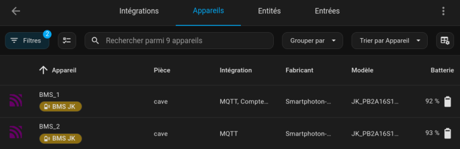

# JK-BMS RS485 Home Assistant Addon

Home Assistant add-on module for managing JK-BMS via Node-RED and Modbus RS485.

## Features

- Configuration interface for JK-BMS software settings
- Modbus RS485 communication
- Control panel integrated into Home Assistant
- Multi-BMS support
- MQTT integration (open to other software)

<form action="https://www.paypal.com/donate" method="post" target="_top">
<input type="hidden" name="hosted_button_id" value="864NCUWH4VJ8N" />
<input type="image" src="https://www.paypalobjects.com/en_US/i/btn/btn_donate_LG.gif" border="0" name="submit" title="PayPal - The safer, easier way to pay online!" alt="Donate with PayPal button" />

</form>

## Screenshot

## Configuration

### Available parameters
 
- path:  The path to the USB port where the Serial port RS485 adapter is connected to your machine
- nb_jkbms: Number of JK BMSs to control (from 1 to 15)
- mqttaddress: The IP address or DNS name of your MQTT broker.By default, this will be the internal address of HAOS.
- mqttport: Port number of the MQTT broker
- mqttuser: User name for MQTT authentication
- mqttpass: Password for MQTT authentication. Put it in quotation marks
- 
## <u>&ndash;&raquo; Complementary and pre-configured Dashboard: &laquo;&ndash; </u>

You can obtain two pre-configured dashboards that you can import into your Home Assistant home automation system. 
This can save you several hours of work in formatting the data by yourself.
Have a look [here](https://ko-fi.com/s/495acc37c7) 

## Installation

### Via the add-on shop

1. Add this repository in Home Assistant: `https://github.com/jean-luc1203/jkbms-rs485-addon`
2. Install the "Smartphoton_JKBMS RS485 Home Assistant Addon"
3. Configure the parameters according to your installation
4. Start the module

### Manual installation (for development)

1. Clone this repository in the `/addons/` folder of your Home Assistant installation
2. Reload the add-ons
3. Install and configure

## Use

- BMS appear in MQTT devices

- Entities created

## Authors & contributors

For the creation of the module under HAOS, I drew inspiration from Nolak's work for smartphoton 
as well as assistance from various AI.
The Node Red flow are from me. Jean-Luc Martinelli or JLM.

## Support

To report problems or request features, use GitHub issues.

## License

MIT License
