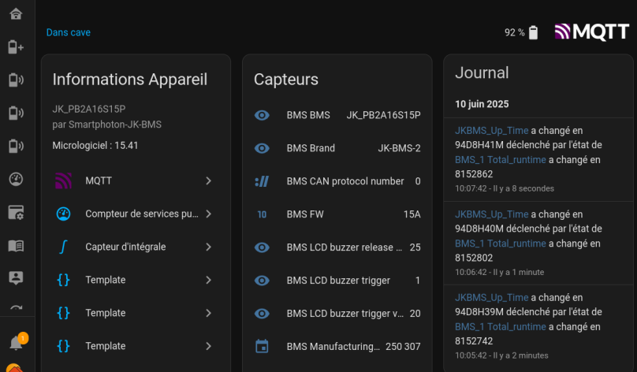

# JK-BMS RS485 Home Assistant Addon

Home Assistant add-on module for managing JK-BMS via RS485 (Modbus)
The software uses Node-RED.

## Features V2.0.0

- Configuration interface for JK-BMS software settings
- Modbus RS485 <--> USB communication
- Modbus RS485 <--> **IP Gateway** (Ethernet or Wifi) communication
- Control panel integrated into Home Assistant
- Multi-BMS support
- MQTT integration (open to other software)
- Multi modes: Master or Listening

## It has 2 operating modes.

**1) Master mode**

In this mode, the software interrogates each BMS (addresses from 1 to 15) via the RS485 bus to retrieve static, setup and dynamic values.
Several parameters can be changed from the software.

To activate Master mode, leave the parameter:

	`bms_broadcasting: false`

**2) Listening mode**

In this mode, the software listens to the rs485 bus. One of the BMSs has been defined as the master of the rs485 bus. This involves setting all 4 small switches to the down or 0000 position.
This is the BMS that will query the other BMSs if any are connected. This BMS will then broadcast the information it has retrieved cyclically every 5 seconds.
It is not possible to change several parameters from the software in this mode.
Only setup and dynamic information is retrieved.
This mode must be used if your inverter requires one of the BMSs to be the Master Bus!

To activate Listen mode, set the parameter

	`bms_broadcasting: true`

  ## Screenshot

  

      

## Configuration

### Available parameters

Section JKBMS
> - **path:**               The path to the USB port where the Serial port RS485 adapter is connected to your machine
> - **nb_jkbms:**           Number of JK BMSs to control (from 1 to 15)
> - **use_gateway:**        Using an IP gateway ?
> - **gateway_ip:**         address of the IP gateway
> - **gateway_port:**       Gateway port number
> - **bms_broadcasting:**   One of the BMSs is configured in master mode (0000)
> - **CAN bus usage:**      Using the CAN bus broadcasting (not yet implemented)

Section MQTT
> - **mqttaddress:**  The IP address or DNS name of your MQTT broker.By default, this will be the internal address of HAOS.
> - **mqttport:**     Port number of the MQTT broker
> - **mqttuser:**     User name for MQTT authentication
> - **mqttpass:**     Password for MQTT authentication. **Put it in quotation marks**

## <u>&ndash;&raquo; Complementary and pre-configured Dashboard: &laquo;&ndash; </u>

You can obtain two pre-configured dashboards that you can import into your Home Assistant home automation system.
This can save you several hours of work in formatting the data by yourself.
Have a look [here](https://ko-fi.com/s/495acc37c7)

## Installation

### Via the add-on shop

1. Add this repository in Home Assistant: `https://github.com/jean-luc1203/jkbms-rs485-addon`
2. Install the "Smartphoton_JKBMS RS485 Home Assistant Addon"
3. Configure the parameters according to your installation
4. Start the module

### Manual installation (for development)

1. Clone this repository in the `/addons/` folder of your Home Assistant installation
2. Reload the add-ons
3. Install and configure

## Use

- BMS appear in MQTT devices

- Entities created

## Authors & contributors

For the creation of the module under HAOS, I drew inspiration from Nolak's work for smartphoton
as well as assistance from various AI.
The Node Red flow are from me. Jean-Luc Martinelli or JLM.

## Support

To report problems or request features, use GitHub issues.

## License

MIT License
